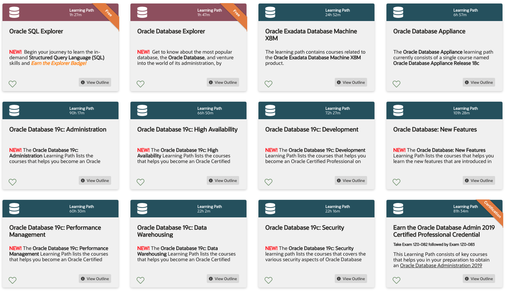

# 001 Oracle Database Learning Subscription

* [01 Oracle SQL Explorer]
* [02 Oracle Database Explorer]
* [03 Oracle Exadata Database Machine X8M]
* [04 Oracle Database Appliance]
* [05 Oracle Database 19c: Administration]
* [06 Oracle Database 19c: High Availability]
* [07 Oracle Database 19c: Development]
* [08 Oracle Database: New Features]
* [09 Oracle Database 19c: Performance Management]
* [10 Oracle Database 19c: Data Warehousing]
* [11 Oracle Database 19c: Security]
* [12 Earn the Oracle Database Admin 2019 Certified Professional Credential]
* [13 Earn the Oracle Database Admin 2019 Certified Professional Credential (Upgrade)]
* [14 Earn the Oracle Database Admin 2019 Certified Professional Credential]
* [15 Earn the Oracle Database SQL Certified Associate Credential]
* [16 Earn the Oracle Database PL/SQL Developer Certified Professional]
* [17 Earn the Oracle APEX Cloud Developer Certified Specialist]
* [18 Earn the Oracle Database Security Expert Credential]
* [19 Oracle Database 12c: Administration]
* [20 Oracle Database 12c: High Availability]
* [21 Oracle Database 12c: Performance Management]
* [22 Oracle Database 12c: Security (Edition 1)]
* [23 Oracle Database 12c: Security (Edition 2)]
* [24 SQL Development]
* [25 Oracle Database Administration]
* [26 PL/SQL Development]
* [27 Application Express Development]
* [28 Oracle Exadata Database Machine]
* [29 Earn the Oracle Database Administration 2019 Certified Professional Credential (CHN)]
* [30 Become an Oracle Application Express 18 Developer]
* [31 Become an Oracle Database 12c Administrator (Foundation)]
* [32 Become an Oracle Database 12c Administrator I]
* [33 Become an Oracle Database 12c Administrator II]
* [34 Become an Oracle Database 12c Administrator (Upgrade from]
* [35 Oracle Database 12c R2: High Availability]
* [36 Become an Oracle Database 12c RAC and Grid Infrastructure Administrator]
* [37 Become an Oracle Database 12c Data Guard Administrator]
* [38 Earn the Oracle Database 12c Administrator Certified Master]
* [39 Become an Oracle Database 11g Advanced PL/SQL Developer (JP)]
* [40 Oracle Enterprise Manager Cloud Control 13c]
* [41 Oracle Enterprise Manager Cloud Control 12c]
* [42 11g High Availability]
* [43 11g Data Warehousing]
* [44 Oracle Database 12c R2 DBA (OCA)]
* [45 Oracle Database 12c R2 DBA (OCP)]
* [46 Oracle Database 12c R1 DBA (OCA)]
* [47 Oracle Database 12c R1 DBA (OCP)]
* [48 Oracle Database 11g DBA (Part 1)]
* [49 Oracle Database 11g DBA (Part 2)]
* [50 Experienced 11g DBA to 19c]
* [51 Experienced 18c DBA to 19c]
* [52 Experienced 12c R2 DBA to 18c]
* [53 Experienced 12c R1 DBA to 12c R2]
* [54 Experienced 11g and Prior DBA to 12c R2]
* [55 Experienced 11g and Prior DBA to 12c R1]
* [56 Experienced 10g and Prior DBA to 11g]
* 👎 [57 Become an ORACLE MASTER Bronze DBA 2019 日本語]
* 👎 [58 Become an ORACLE MASTER Silver DBA 2019 日本語]
* 👎 [59 Become an ORACLE MASTER Silver SQL 2019 日本語]
* 👎 [60 Become an ORACLE MASTER Gold DBA 2019 日本語]
* 👎 [61 Become an ORACLE MASTER Bronze Oracle Database 12c 日本語]
* 👎 [62 Become an ORACLE MASTER Silver Oracle Database 12c 日本語]
* 👎 [63 Become an ORACLE MASTER Gold Oracle Database 12c 日本語]
* 👎 [64 Become an ORACLE MASTER Gold Oracle Database 12c (移行試験) 日本]
* 👎 [65 Become a 12c RAC Administrator 日本語]
* 👎 [66 Become an ORACLE MASTER Silver Oracle PL/SQL Developer 日本語]
* 👎 [67 Become an ORACLE MASTER Gold Oracle PL/SQL Developer 日本語]
* 👎 [68 Advanced Administration (JP)]
* 👎 [69 11g Administration (JP)]
* [70 Getting Started with Big Data]
* [71 Oracle Big Data for Administrators]
* [72 Oracle Big Data for Developers]
* [73 Oracle Big Data Analyst]
* [74 Big Data Industry Trends]
* [75 Data Analysis and Machine Learning]
* [76 Oracle Access Management and Governance]
* [77 Oracle Identity Manager, Governance, and Federation]
* [78 Database Security]
* [79 MySQL]
