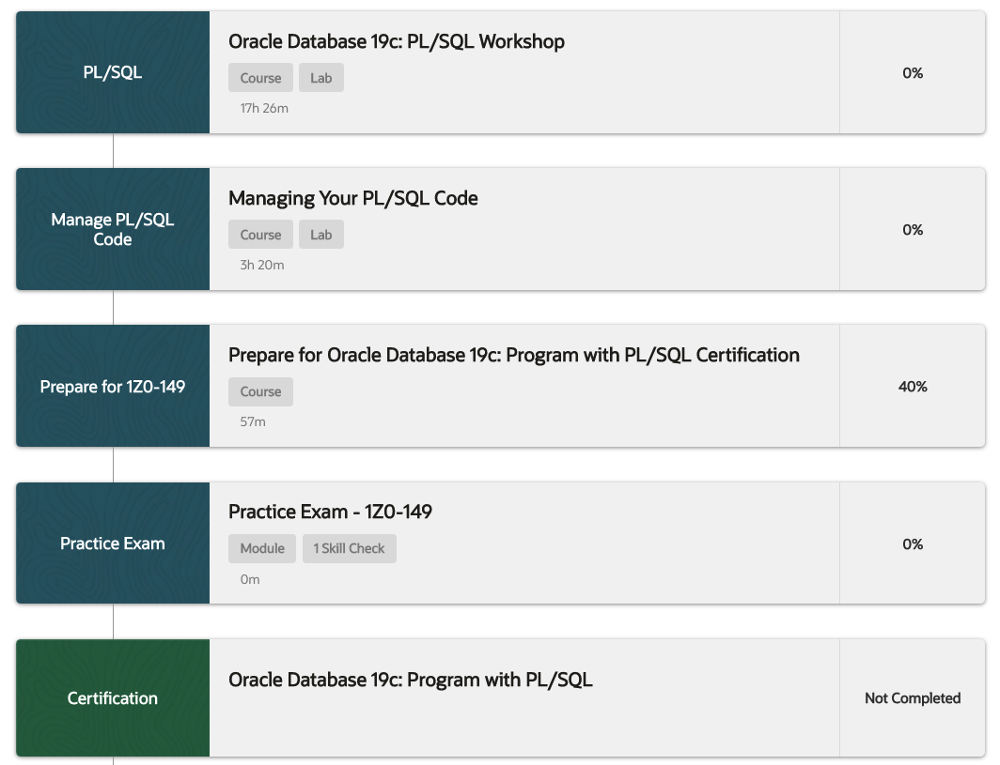
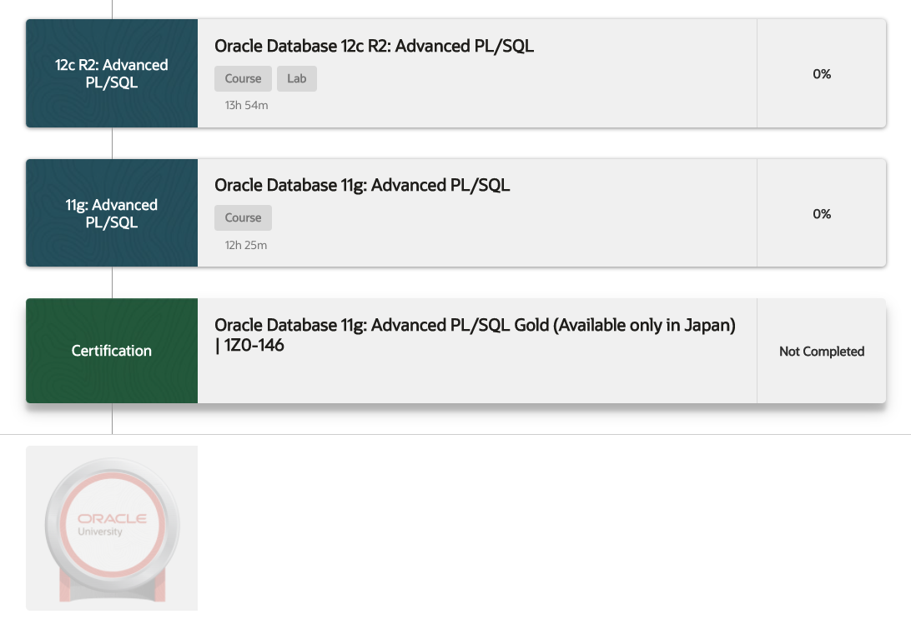

# 26 PL/SQL Development

### Learning Path - 48h 1m

This Learning Path teaches you how to develop stored procedures, functions, packages and database triggers. You'll learn to manage PL/SQL program units and dependencies, and usage of some of the Oracle-supplied packages.

### Learn To:

* Conditionally control code flow (loops, control structures).
* Use PL/SQL packages to group and contain related constructs.
* Generate triggers to solve business challenges.
* Create anonymous PL/SQL blocks, as well as stored procedures and functions.
* Use some of the Oracle supplied PL/SQL packages to generate screen output and file output.
* Create anonymous PL/SQL blocks, functions and procedures.
* Declare PL/SQL variables.
* Create PL/SQL blocks of application code that can be shared by multiple forms, reports and data management applications.
* Debug functions and procedures using the SQL Developer Debugger.
* Use Dynamic SQL & understand design considerations when coding using PL/SQL.
* Understand and influence the PL/SQL compiler and manage dependencies.
* Manage PL/SQL subprograms, triggers, declaring identifiers and trapping exceptions.

### Benefits To You:

Extend the functionality of the SQL language with PL/SQL language to write application code so that your organization can realize the full benefit of utilizing Oracle best practices.

